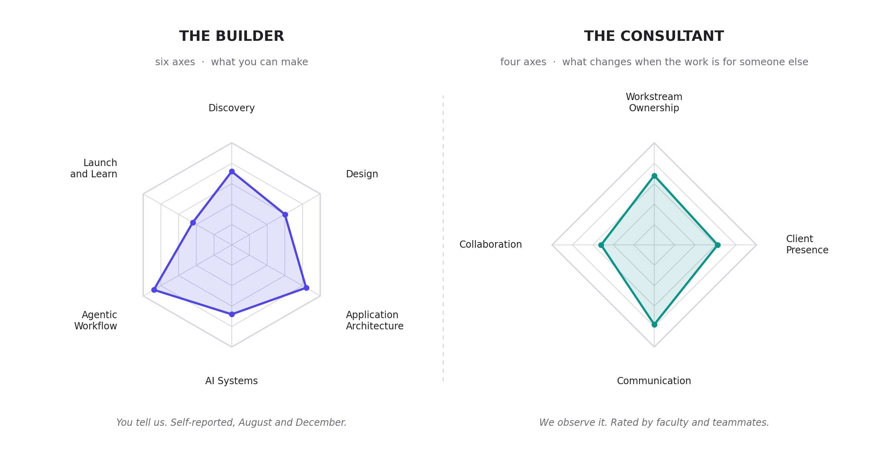

::: {.course-numbers-page}
MBA 693R · STRAT 490R
:::

The **BYU AI Foundry** is an AI-native product studio and consultancy, and an official program
of the BYU Marriott School of Business. We build AI products. One team works out what is worth
building and then ships it, because those are no longer two jobs.

**This site is the student program guide.** It covers the course, how client teams are staffed,
and the standard your work is held to. Everything a prospective client reads lives on the
official website, [aifoundry.byu.edu](https://aifoundry.byu.edu).

The Foundry is not an internship placement and not a research project. Every engagement ends
with software running in the client's hands, and a real company has paid for it.

There is no prerequisite. Many students take
[Build, IS 693R / MSB 341](https://byu-strategy.github.io/product-management/), first. Many take
both classes in the same semester. What you have already shipped does not decide whether you are
in the Foundry. It decides what you own on a team.

## Course Numbers

This course is cross-listed under two course numbers. It is all the same class: everyone meets
together Fridays 8:00 to 11:50 AM in 2140 TNRB, works on the same client teams, uses this site,
and is graded on the same rubric. Register under whichever number fits your program.

| Course | Section | Title | Credit Hours |
|--------|---------|-------|--------------|
| MBA 693R | 011 | Special Topics in Management | 3.0 |
| STRAT 490R | 001 | Topics in Strategic Management | 3.0 |

Mixed MBA and undergraduate teams are intentional. The MBAs bring the business judgment, the
undergraduate builders bring engineering depth, and on a Foundry team those are the same job.

## Start Here

- [Syllabus](students/01-syllabus.qmd): Grading, policies, and course information
- [Getting Started](students/02-getting-started.qmd): Onboarding checklist and expectations
- [How Teams Are Staffed](students/05-how-teams-are-staffed.qmd): Pods, archetypes, and the points auction
- [Weekly Updates](students/03-weekly-updates.qmd): How to write your end-of-week progress emails
- [Build Standards](students/04-build-standards.qmd): How Foundry work is expected to be built and shipped

## How We Develop Builders

The Foundry trains full-stack product builders: people who can carry an idea from a user problem
to a working product someone actually uses, with AI as both the material and the tool.

Two shapes describe that person.

**The Builder** is what you can make. Six axes: Discovery, Design, Application Architecture, AI
Systems, Agentic Workflow, and Launch and Learn. Students self-report on all six at the start of
fall semester and again in December, and see their own profile both times.

**The Consultant** is what changes when the work belongs to someone else. Four axes: Ownership,
Client Presence, Communication, and Collaboration. These are not self-reported. Faculty and
teammates rate them against observed behavior at midterm and at the end of the term.

Nobody arrives strong on all ten. Teams are staffed so the team covers every Builder axis even
when no single member does.

| Class | What it does |
|---|---|
| **Build**, IS 693R / MSB 341 | Raises your floor. The goal is not a 5 anywhere, it is nothing below a 3 |
| **The Foundry Lab**, this course | Tests your ceiling, and is the only place the Consultant axes develop at all |

## What the Client Is Buying

You should know the commercial shape of the work, because it governs what you can promise.

| | |
|---|---|
| **Fee** | $22,000, fixed, for an 8-month engagement |
| **Covers** | All three phases: discovery, build, and transfer |
| **Delivery capacity** | 2 builders at 10 hours each per week. 640 hours total |
| **On top of that** | A QC lead and faculty oversight |
| **Client commitment** | About 1 hour per week from a named point of contact |
| **IP** | The client retains all deliverables and IP |

**One engagement ships one product.** 640 hours builds and ships one focused product. It does
not build two. When a client arrives with several ideas, each becomes its own engagement with
its own pod and its own fee. Discovery exists to make sure the scope fits inside the capacity
rather than the other way around.

The team is small on purpose. Two builders with QC and faculty oversight riding on top is enough
to ship something real and not enough to sprawl.

## How Engagements Run

**Find the problem, build the thing, hand it over.**

| | Phase | What we deliver |
|---|---|---|
| **01** | Audit and discovery | An AI-specific audit that points at specific things to build, with an estimate and a sequence |
| **02** | Build | Production code, integrated with the client's systems, running in their environment |
| **03** | Transfer | Co-working throughout the build, then handoff. The capability stays in-house |

## How Teams Are Staffed, in Short

Fit decides which projects you are eligible for. Points decide which eligible project you get.

- **One engagement, one pod:** an engagement lead, two builders, a QC lead, and faculty
  oversight. A builder is on exactly one engagement at a time.
- **Six archetypes** describe what a project needs and what you can do. A pod needs a rated 3 in
  the project's primary archetype, plus a second 3 on the bench as backup.
- **100 points a month, capped at 300.** Eligible builders bid sealed for the open seat.
  Second-highest bid sets the price, so bid your real level of interest.
- **The Foundry runs at most 6 concurrent engagements**, with a seventh pod held in reserve. The
  binding constraint on how much work we take is builder hours, not demand.

Full rules: [How Teams Are Staffed](students/05-how-teams-are-staffed.qmd).

## Contact

**AI Foundry**, BYU Marriott School of Business

[aifoundry.byu.edu](https://aifoundry.byu.edu) · aifoundry@byu.edu

**Scott Murff**, Faculty Advisor · scott.murff@byu.edu
